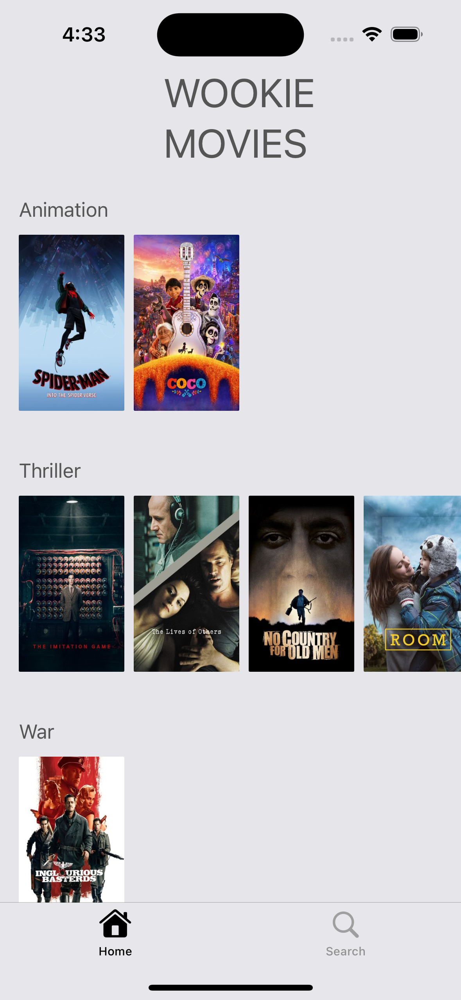
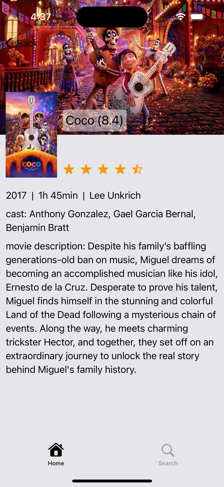
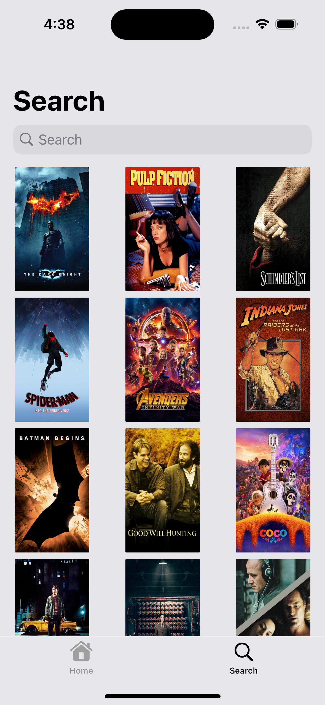

# Wookie-Movies
Simple movies app based on the Wookie Movies APIs. Implemented using SwiftUI and Swift concurrency.

## 📱 App Screenshots

### Movies Screen

### Movie Details Screen

### Search Screen

